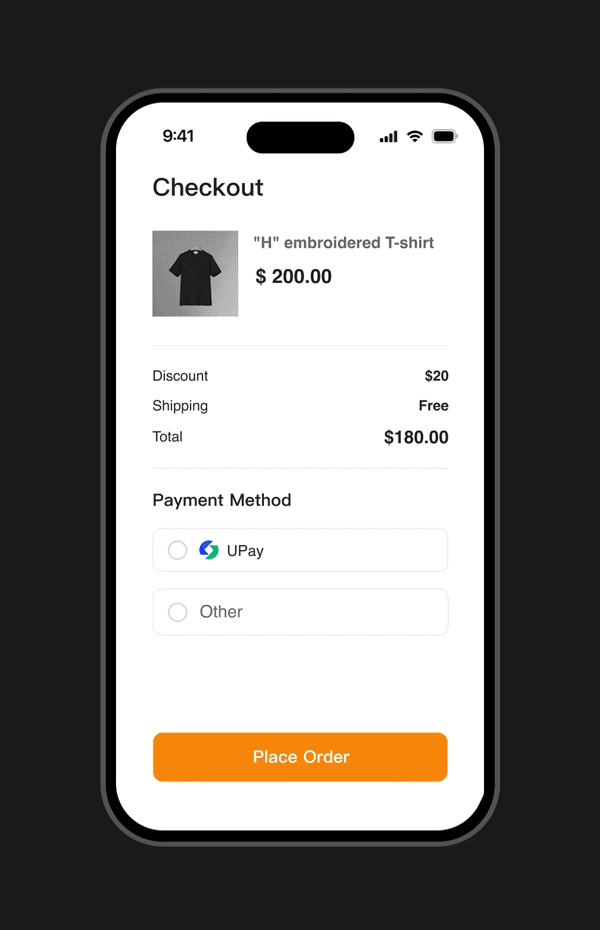

# 👋 简介

<figure><figcaption></figcaption></figure>

## 系统介绍

UPay 是专业的 USDT 支付平台，简单易用、安全稳定、不掉单/不撞单，强大的财务管理功能。用户直接付款到您自己的钱包地址，确保您的资金安全，支持 API 收付款。自带 USDT 风控系统，可以避免您收到黑U和标记U。可个性化功能定制、私有化部署。

## 收款演示

<figure><figcaption></figcaption></figure>

## 在开始接入之前，你需要：

1. 注册并登录 **商户后台；**
2. 在商户后台查看接入必需的 **AppID** 和 **Appsecret；**
3. 阅读我们有关 **安全说明** 及 **签名算法** 相关的说明；
4. 然后你可以阅读后续文档，并尝试通过接口发起 **订单创建** 请求。


如你在接入过程中遇到任何问题，可随时联系在线客服和我们取得联系。

[**技术支持**](https://t.me/UPay\_ink)


