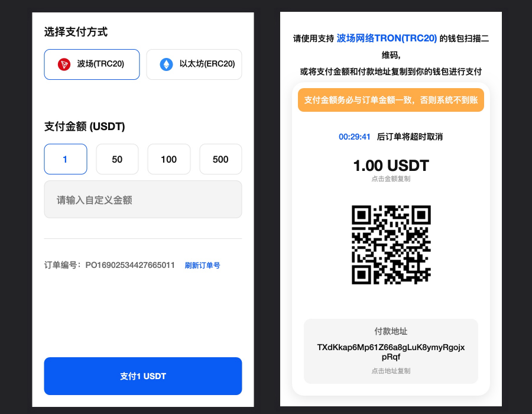

# 🗳️ 收银台

商户可直接从创建订单返回数据中，取出 `payUrl` 字段，然后跳转至该地址，供用户支付。

演示地址：[https://app.upay.ink/payment/index?id=joz4QnND](https://app.upay.ink/payment/index?id=joz4QnND)

<figure><figcaption></figcaption></figure>
